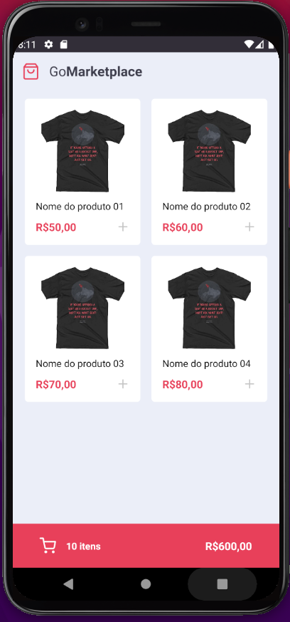
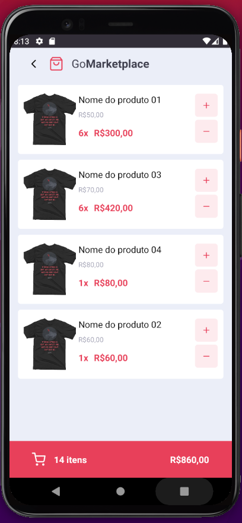

<h1>GoMarketplace</h1>

## 🚀 Tecnologias

Esse projeto Mobile foi desenvolvido com as seguintes tecnologias:

- [React-Native]
- [Styled-components]

## 💻 Projeto

Um Projeto simples de um  marketplace.
  <h4>Features:</h4>
  <ul>
    <li>Dashboard de produtos</li>
    <li>Carrinho de comprar</li>
    <li>Total de itens no carrinho</li>
    <li>Total dos produtos no carrinho</li>
  </ul>

## 🔖 Layout

<table>
  <tr>
    <td><strong>Dashboard dos produtos</strong></td>
    <td><strong>Carrinho</strong></td>
  <tr>
   <tr>
    <td></td>
    <td></td>
  <tr>
</table>

## Licença

Esse projeto está sob a licença MIT.

Execute yarn install ou npm install para instalação.

Execute yarn json-server server.json -p 3333 para iniciar o backend.

Execute yarn android ou yarn ios para carregar o App.
